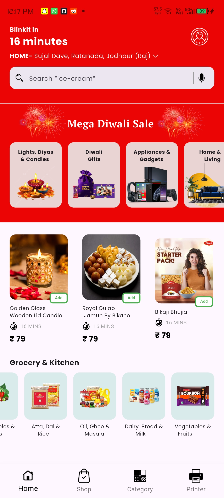

# 🛒 Blinkit UI Clone (Flutter)

A visually accurate clone of the Blinkit grocery delivery app UI, built using Flutter. This project focuses on replicating the modern, responsive, and intuitive design of Blinkit to improve UI/UX development skills and explore Flutter's layout and widget system.

## 🚀 Features

- Clean, modern UI inspired by Blinkit
- Home screen with banners, product categories, and featured items
- Product cards with image, name, price, and discount
- Bottom navigation bar for quick access
- Cart preview and checkout screen UI
- Responsive layout for various screen sizes

> ⚠️ This is a **UI-only clone**, and does not include backend or real-time data integration (yet).

---

## 🛠️ Tech Stack

- **Flutter** (latest stable version)
- **Dart** programming language
- **Provider / Riverpod** (for state management - optional based on your plan)
- **Custom assets** (icons, images)

---

## 📸 Screenshots



---

## 📂 Project Structure

```

blinkit_ui_clone/
├── lib/
│   ├── main.dart
│   ├── domain/
│   │   └── constants/
│   │       └── appcolors.dart
│   ├── ui/
│   │   ├── screens/
│   │   │   ├── bottomnavbar/
│   │   │   │   └── bottomnavbar.dart
│   │   │   ├── category/
│   │   │   │   └── categorysection.dart
│   │   │   ├── homescreen/
│   │   │   │   └── homescreen.dart
│   │   │   ├── login/
│   │   │   │   └── login_screen.dart
│   │   │   ├── printer section/
│   │   │   │   └── printerpage.dart
│   │   │   └── shopingscreen/
│   │   │       └── shoping_screen.dart
│   │   └── widgets/
│   │       ├── customappbar.dart
│   │       ├── Customcard.dart
│   │       ├── HomeScreenCards.dart
│   │       ├── minicards.dart
│   │       └── uihelper.dart
├── assets/
│   ├── images/
│   └── icons/
└── pubspec.yaml


````

---

## 🧪 Getting Started

1. **Clone the repo:**

   ```bash
   git clone https://github.com/your-username/blinkit_ui_clone.git
   cd blinkit_ui_clone
   ```

2. **Install dependencies:**

   ```bash
   flutter pub get
   ```

3. **Run the app:**

   ```bash
   flutter run
   ```

---
